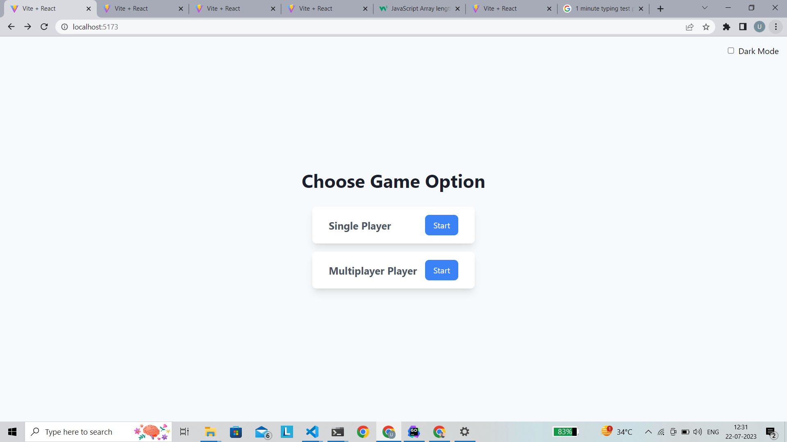
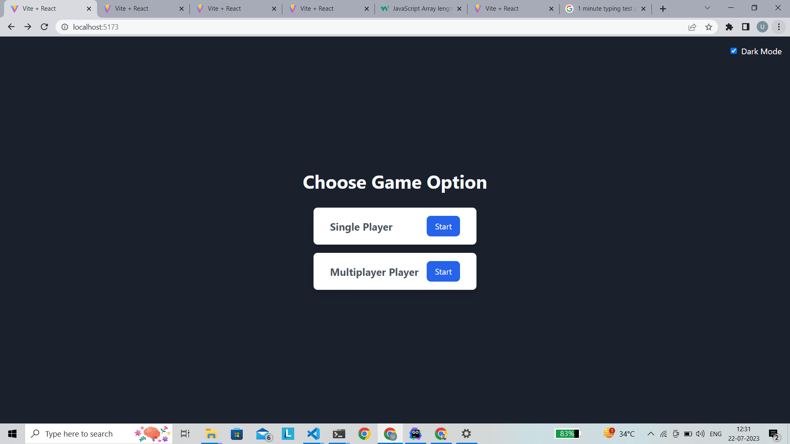
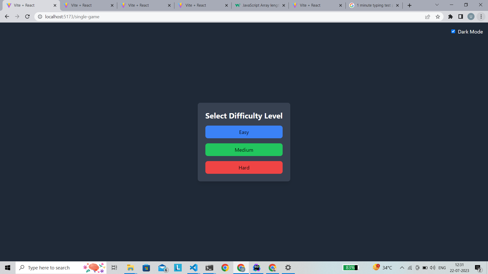
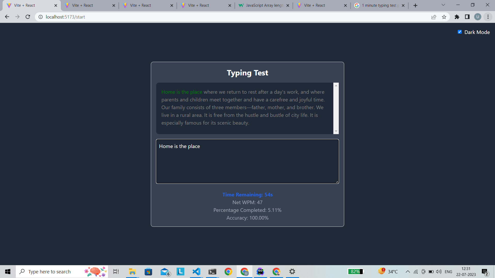
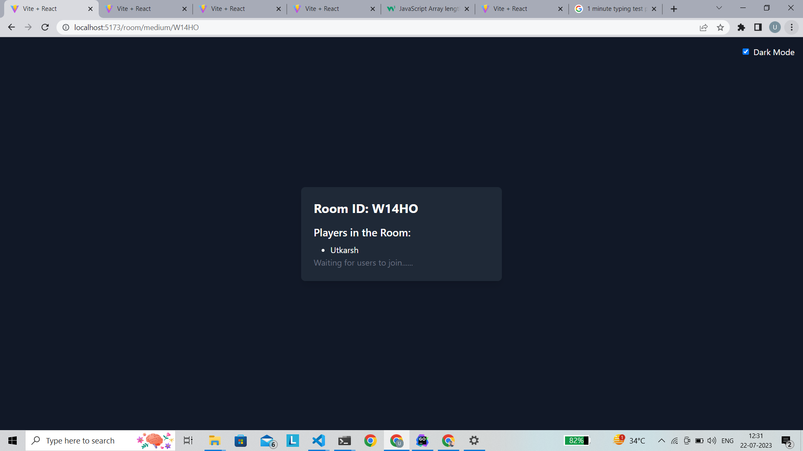
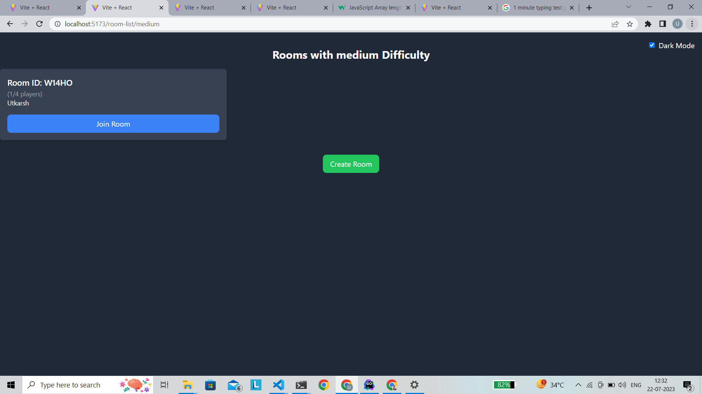
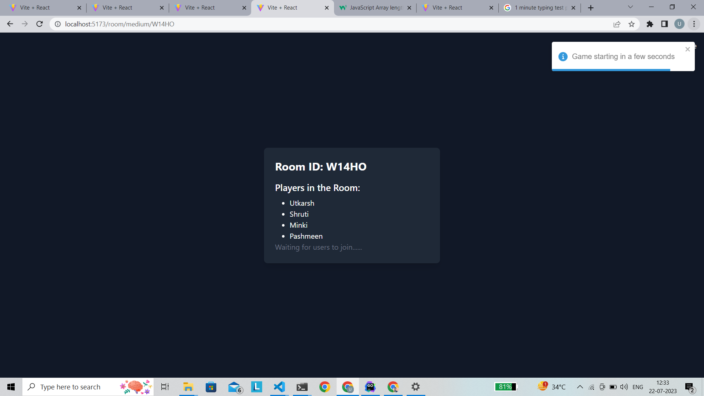
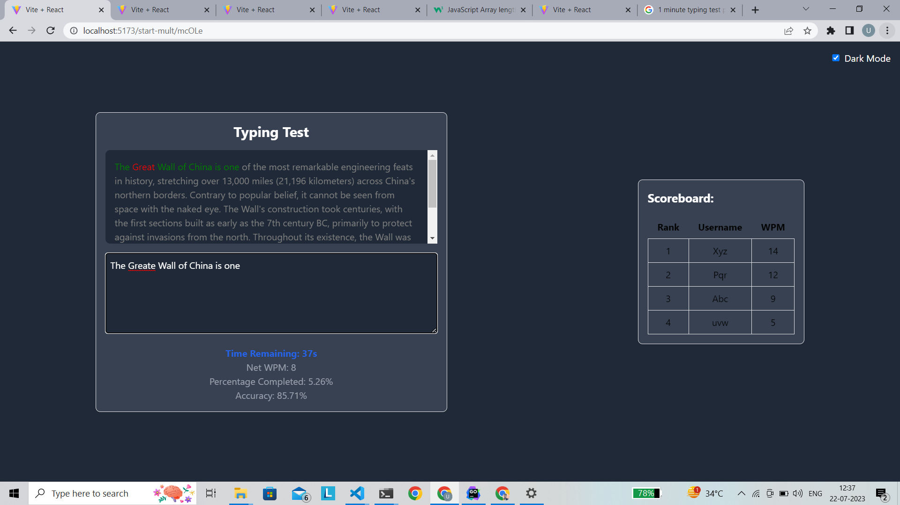

# CodeTally Typing Game

**Typing Game** is a multiplayer and single player with very easy user experience.

## How to Play

1. Clone this repository and navigate to the client folder using `cd client`.
2. Run `npm install` to install the required dependencies.
3. Start the development server by running `npm run dev`.
4. Open another terminal and navigate to the server folder using `cd server`.
5. Run `npm install` to install the server-side dependencies.
6. Start the server by running `nodemon index`.

## Features

- Choose a difficulty levels.
- Real-time multiplayer mode to compete with your friends.
- Track your typing speed and accuracy with live feedback.
- View high scores and challenge yourself to improve.
- Guest mode available for quick gameplay without signup.

## Experience and UI

